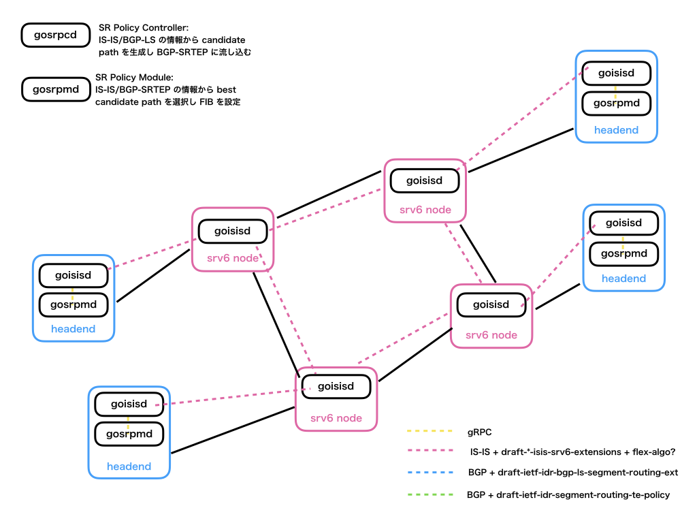
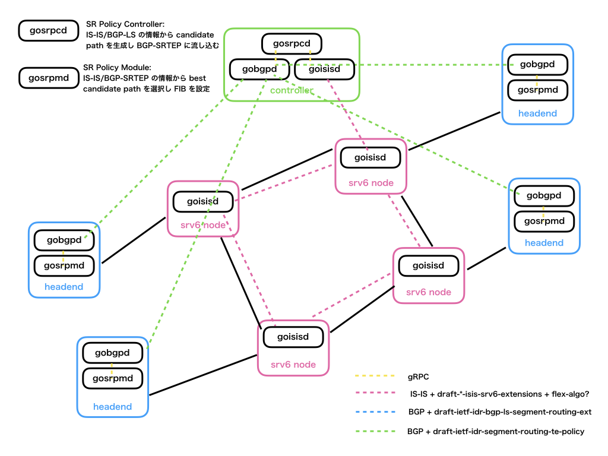
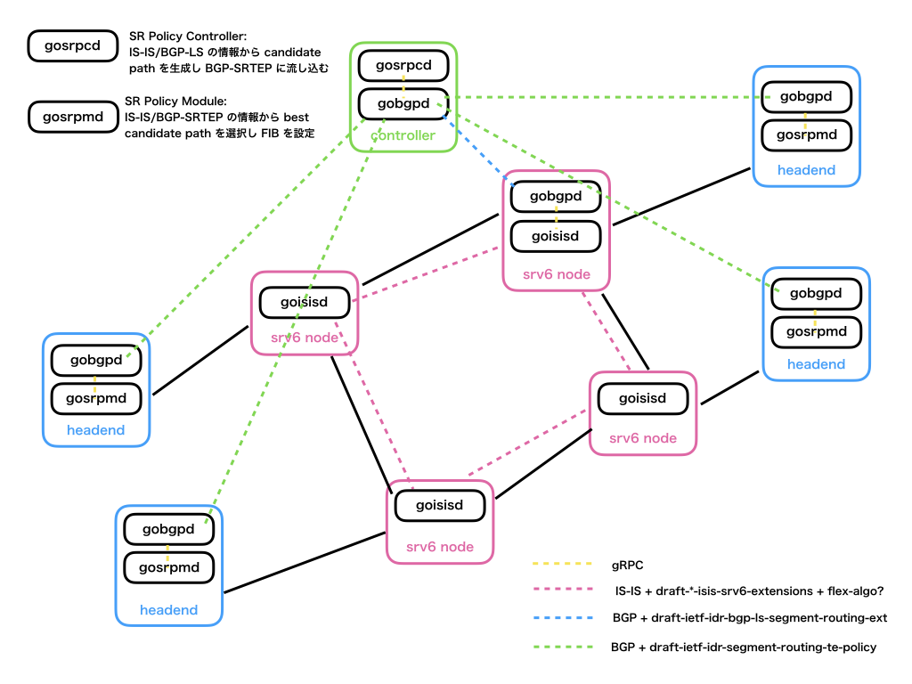

# SRv6 計画

## goisisd 設定ファイルイメージ

https://tools.ietf.org/html/draft-ietf-isis-yang-isis-cfg

```
[config]
  enable = true
  level-type = "level-1"
  system-id = "36d3.642f.27ad"
  area-address = ["01"]
  [authentication.config]
    key = "hogehoge"
    crypto-algorithm = "md5"
    [authentication.level-1.config]
      key = "piyopiyo"
      crypto-algorithm = "md5"

[[interfaces]]
  [interfaces.config]
    name = "eth0"

[[interfaces]]
  [interfaces.config]
    name = "eth1"
```

## 構成例

### IS-IS のみ構成


### IS-IS + コントローラ構成


### IS-IS + BGP-LS + コントローラ構成

